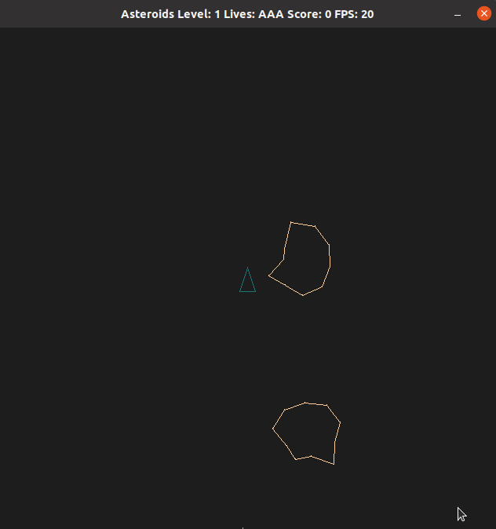

# CPPND: Capstone Project - Asteroids Game

This repo is my Capstone Project for the [Udacity C++ Nanodegree Program](https://www.udacity.com/course/c-plus-plus-nanodegree--nd213). 
Option 1 was selected for the project, that is, developing a clone of the classic Asteroids game.

## Dependencies for Running Locally
* cmake >= 3.7
  * All OSes: [click here for installation instructions](https://cmake.org/install/)
* make >= 4.1 (Linux, Mac), 3.81 (Windows)
  * Linux: make is installed by default on most Linux distros
  * Mac: [install Xcode command line tools to get make](https://developer.apple.com/xcode/features/)
  * Windows: [Click here for installation instructions](http://gnuwin32.sourceforge.net/packages/make.htm)
* SDL2 >= 2.0
  * All installation instructions can be found [here](https://wiki.libsdl.org/Installation)
  >Note that for Linux, an `apt` or `apt-get` installation is preferred to building from source. 
  >For Debian based systems like Ubuntu use "sudo apt-get install libsdl2-2.0-0" or "sudo apt-get install libsdl2-dev"
* gcc/g++ >= 5.4
  * Linux: gcc / g++ is installed by default on most Linux distros
  * Mac: same deal as make - [install Xcode command line tools](https://developer.apple.com/xcode/features/)
  * Windows: recommend using [MinGW](http://www.mingw.org/)

## Basic Build Instructions
1. Clone this repo.
2. Make a build directory in the top level directory: `mkdir build && cd build`
3. Compile: `cmake .. && make`
4. Run it: `./AsteroidsGame`.

## Playing the game
  * The goal is to destroy all asteroids before any hits the ship.
  * Press the spacebar to have the ship firing bullets.
  * Press right or left arrow keys to rotate the ship.
  * Press the up arrow to move the ship forward.
  * Points are accumulated destroyng asteroids, smaller fragments have higher value.
  * The ship has 3 lives, which are lost when hit by an asteroid. The game is over after losing its 3 lives.  

## Code Structure
* game.cpp/.h
  * Defines the Game class. An instance of this class runs the game, defines the game loop that reads inputs, updates state and renders on the screen.
  * The game object manages a list with all the game objects (asteroids, ship, bullets and explosion particles). 
  * Its Game::Update() method creates bullets, moves objects, wraps them around screen edges, checks collisions between bullets, asteroids and the ship, splits asteroids, throws dust particles after collisions, erases destroyed objects and increases the game level.
* object.cpp/.h
  * Defines the Line and Object classes.
  * The Line class allows detection of intersection between lines per https://www.geeksforgeeks.org/check-if-two-given-line-segments-intersect/.
  * The Object class has a list of all the points of a game object and properties to handle its rotation/translation across the screen like its position, speed, acceleration, friction, applied force, etc.
  * The Object class models the object movement as particles (Object::move() method) following uniformly accelerated linear motion, and its rotation with uniformly accelerated angular motion per https://www.profesorenlinea.cl/fisica/Movimiento_rectilineo_acelerado.html, http://19e37.com/wiki/index.php/Movimiento_Circular_Uniformemente_Acelerado_-_MCUA and https://www.toptal.com/game/video-game-physics-part-i-an-introduction-to-rigid-body-dynamics.
  * Also implements the collision() method to find out when one object hits another.
  * The Object class is a virtual class used as baseline for other game objects.
* asteroid.cpp/.h
  * Defines the Asteroid, Ship, Bullet and Dust classes.
  * The Asteroid class adds resize, and generation properties to split them after being hit by a bullet. It defines asteroids with constant linear and angular speed.
  * The Ship class sets the Object properties to enable movement with acceleration and friction. It also adds a ghost property so after a ship is hit/destroyed, when relocated to the screen center it is not destroyed again during a few seconds if it overlaps with an asteroid.
  * The Bullet class is also set for constant speed and for auto destruction after traveling a fixed distance.
  * The Dust class defines particles with constant speed and auto destruction. It is defined as a separate class so it has no interaction with other objects.
* controller.cpp/h
  * Class that provides a method to handle the game input. It applies/removes acceleration and rotation forces to the ship when the arrow and space bar keys are depressed.
* renderer.cpp/.h
  * Contains the logic to render all game objects on the game window.
  * Its render method receives the list of game objects and draws each of them using lines connecting all its points.
* fastSineCosine.cpp/h
  * Defines the Sine and Cosine objects which precalculate sine and cosine values upon being instantiated so its calculation cost is not paid every time the game performs a trigonometric operation. 
* main.cpp
  * Instantiates Renderer, Controller and Game objects to start the game loop. 

## README Rubric
* Includes building, running instructions.
* Indicates project option selected.
* List of rubric points that are met is included.

## Compiling and Testing Rubric
* Project compiles and runs without errors.

## Loops, Functions, I/O
* Function and control structures are used across the Game, FastSineCosine, Object and Asteroid classes. Game::Update() and Object::isInside(SDL_FPoint) as well as other methods can be checked as samples.
* The project reads the arrow and spacebar keys to control the game ship.

## Object Oriented Programming
* The Object, Asteroid, Bullet and Dust classes were created to handle the game objects.
* Public, protected and private access specifiers are used in the aforementioned classes.
* Aforementioned classes initialize instance properties in its constructors.
* Aforementioned classes use method names according to their purpose.
* Aforementioned classes hide its logic details through their methods.
* Composition is used in aformentioned classes as well as in the game class. The Object, Asteroid, Bullet and Dust classes form a class hierarchy where Object is the parent class.
* The "==" operator is overloaded for SDL_FPoints in the Object module. Object::isInside() has different signatures. Sine and Cosine classes overload the () operator.
* The Ship::move() method overrides the Object::move() method.

## Memory Management
* Render::Render(), Game::Update(), Object::isInside() and Object::collision() use references, local references are used within Game and Object classes methods.
* Smart pointers are used as elements of the Game::objects vector to manage game objects.

## CC Attribution-ShareAlike 4.0 International

Shield: [![CC BY-SA 4.0][cc-by-sa-shield]][cc-by-sa]

This work is licensed under a
[Creative Commons Attribution-ShareAlike 4.0 International License][cc-by-sa].

[![CC BY-SA 4.0][cc-by-sa-image]][cc-by-sa]

[cc-by-sa]: http://creativecommons.org/licenses/by-sa/4.0/
[cc-by-sa-image]: https://licensebuttons.net/l/by-sa/4.0/88x31.png
[cc-by-sa-shield]: https://img.shields.io/badge/License-CC%20BY--SA%204.0-lightgrey.svg
